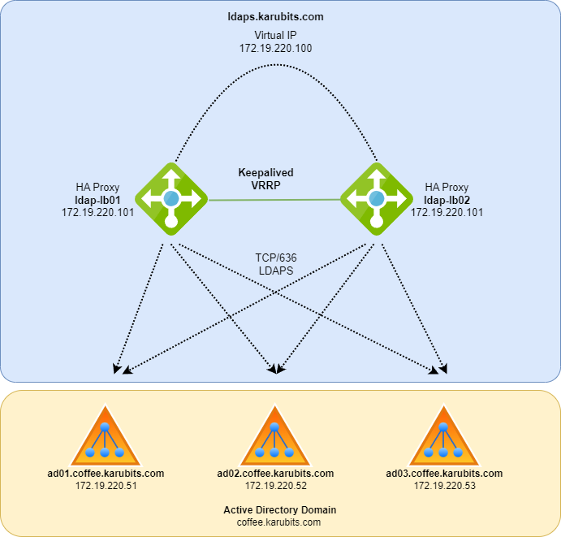

Typically in organizations that have an active directory or OpenLDAP infrastructure will most likely have internal and external services connecting to the directory using the LDAP protocol and typically used for authenticating users or looking up user information from a central directory. 

Maintaining constant availability to LDAP is usually crucial for most organizations and the last thing any administrator wants is users making claims the login page for their application doesn't work anymore. 

The main challenges I have come across with LDAP for external services are:
1. The application only supports a single LDAP server for its configuration. 
2. In the case of Active Directory this can be somewhat mitigated by using the Active Directory domain name. e.g. 'coffee.karubits.com' however this is only DNS round robin. If you have three servers and one fails this means every 3rd attempt to connect will fail. 
3. In the case of Active Directory again, once you deploy Active Directory servers in different geographical regions DNS round robin will simply go through every server regardless of AD servers location causing latency on non local LDAP response.
4. When Active Directory Certificate Services (ADCS) there maybe use cases where the internal certificate trust chain can't be installed on the 3rd party application. 

Based on experiences from the above I set out with the following goals in mind:
- Deploy load balancers in front of the AD or LDAP servers to evenly distribute traffic.
- The load balancers perform active health checks encase of a LDAP server failure. 
- The load balancers need to be in a HA pair encase of a load balancer failure. 
- The load balancers have a public trusted certificate for ease of 3rd party integrations. 
- The load balancer trusts the ADCS CA certificates. 
- End-to-end encryption. 

Before we jump in its probably a good idea to cover the three different methods for connecting to an LDAP server. 

| Protocol | Port | Note
| :-- | :-- | :--
| LDAP | 389 | Unencrypted 
| Start TLS LDAP | 389 | Opportunistic TLS - Negotiates encrypted and can fall back to unencrypted for compatibility.
| LDAPS | 636 | Implicit encryption

LDAP been unencrypted is out.  
In regards Start TLS vs LDAPS there is a fair bit of contention between which one is more secure and the state of LDAPS (check references).  At least from my research HAProxy doesn't support StartTLS as its negotiated at the application level. I have also found some 3rd applications do not support StartTLS and LDAPS was available in those cases. 

# References

- [HA Proxy forum - Terminating opportunistic TLS (STARTTLS)](https://discourse.haproxy.org/t/terminating-opportunistic-tls-starttls/3681/2)
- [Wikipedia - Opportunistic TLS - Weaknesses and mitigations](https://en.wikipedia.org/wiki/Opportunistic_TLS#Weaknesses_and_mitigations)
- [StackExchange - Why is LDAP with STARTTLS preferred over LDAPS](https://unix.stackexchange.com/questions/607560/why-is-ldap-with-starttls-preferred-over-ldaps)